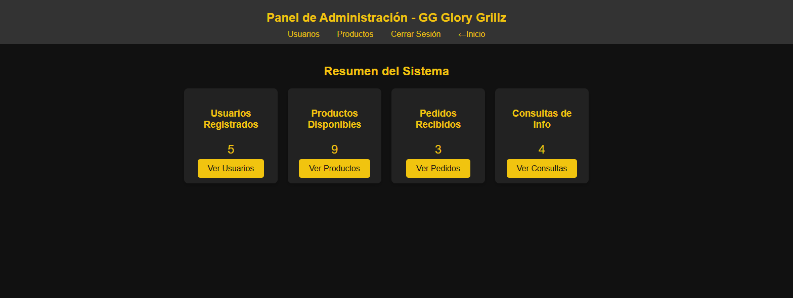
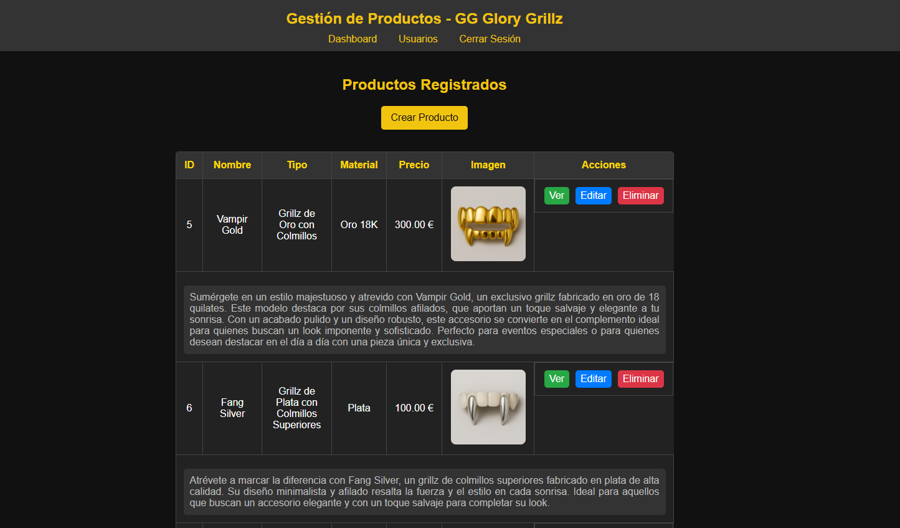

# 💎 Glory Grillz - Full Stack Web App

Modern full stack web application for managing and showcasing custom grillz products.  
Built with CodeIgniter 4 following MVC architecture and real-world backend practices.

---

## 🚀 Features

- 🔐 Authentication system (login / register)
- 👤 Role-based access (admin / user)
- 🛒 Product management (CRUD)
- 📦 Custom order request system
- 📩 Contact and information forms
- 🎨 Clean and responsive UI
- 🗂 MVC architecture (CodeIgniter 4)
- ⚡ Optimized structure and performance

---

## 🛠 Tech Stack

- PHP (CodeIgniter 4)
- MySQL (XAMPP)
- HTML / CSS / JavaScript
- MVC Architecture

---

## 📸 Preview

### 🏠 Home
<p align="center">
  
</p>

### ✨ Features Section
<p align="center">
  
</p>

### 🛍 Products
<p align="center">
  
</p>

### ⚙️ Admin Panel
<p align="center">
  
</p>


<p align="center">
  
</p>

### 🔐 Login
<p align="center">
  
</p>

---

## ⚙️ Installation

```bash
git clone https://github.com/Nacho-Ortiz-FullStackDeveloper/glory-grillz.git
cd glory-grillz
composer install
